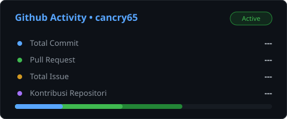

# Halo, Saya Can Cry! 👋

Seorang pelajar dan penggiat musik yang berdomisili di Banjarmasin.

## 📌 Tentang Saya

* 🎂 **Kelahiran**: Tabalong, 11 Juni 2008
* 🏫 **Pendidikan Saat Ini**: SMKN 4 Banjarmasin

## ✈️ Perjalanan Hidup & Pendidikan

* **2008**: Lahir di Tabalong.
* **Usia 4 Tahun**: Pindah ke Bandung dan mulai bersekolah hingga kelas 3 di MI Nurul Huda.
* **Usia 7–8 Tahun**: Pindah ke Palangka Raya dan melanjutkan sekolah hingga kelas 5 di SDN 1 Bukit Tunggal.
* **Lulus SD**: Pindah ke Banjarmasin dan menyelesaikan pendidikan di SDN Pangeran 3.
* **SMP**: Lulus dari SMPN 13 Banjarmasin.
* **SMA/SMK**: Saat ini menempuh pendidikan di **SMKN 4 Banjarmasin**.

## 🏆 Prestasi & Minat

* **Drumband**: Berhasil meraih puluhan penghargaan dan prestasi di bidang musik drumband.

## 📊 Statistik GitHub

<p align="center">
  
</p>

<p align="center">
  
</p>

---

*Catatan: Jika kamu ingin menggunakan file SVG manual `metric.svg` yang telah dibuat sebelumnya, kamu bisa mengunggah berkas tersebut ke repositori profil GitHub kamu dan menampilkannya dengan kode berikut:*

```markdown

